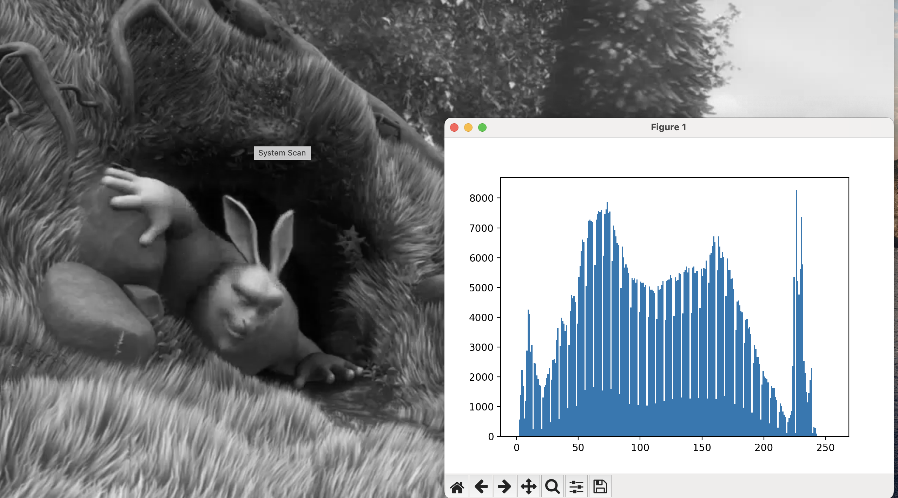
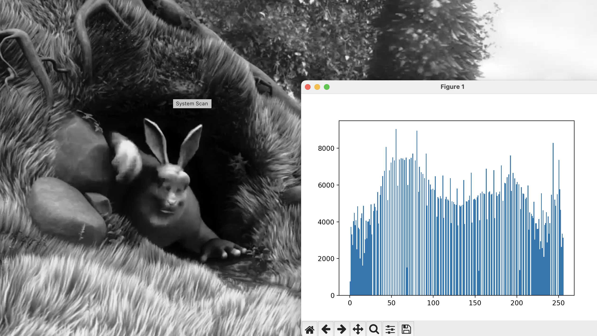
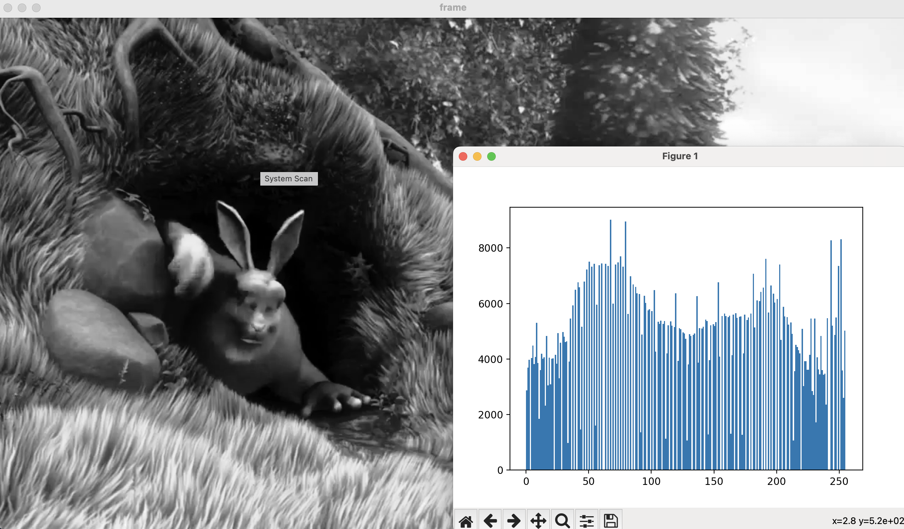

# LW1

## Задание
  1. Реализовать программу согласно варианту задания. Базовый алгоритм, 
используемый в программе, необходимо реализовать в 3 вариантах: с 
использованием встроенных функций какой-либо библиотеки (OpenCV, 
PIL и др.) и нативно на Python + |с использованием Numba или C++|.
  2. Сравнить быстродействие реализованных вариантов.
  3. Сделать отчёт в виде readme на GitHub, там же должен быть выложен 
исходный код

## Вариант 2

   "Эквализация гистограммы". На вход поступает видео, программа на 
выходе отрисовывает два окна: с рассчитанной гистограммой и 
изображением. По нажатию определенной кнопки на клавиатуре 
изображение должно переключаться между исходным и после 
эквализации.

В рамках задания были реализованы 3 версии программы:
- с использованием opencv (equalizeHist);
- алгоритм эквализации пишется нативно на питоне numpy;
- алгоритм эквализации пишется нативно на питоне numpy + используется Numba;

## Теория
Эквализация гистограммы - метод увеличения контрастности изображения. При обработке вычисляется гистограмма яркости 
пикслей изображения, считается функция распределения и применяется формула.

## Описание разработанной системы

Переключение режима работы производится нажатием клавиши Пробел.

## Замер производительности.
### Результат работы программы + вывод на экран до эквализации:

### Результаты работы на OPENCV:

### Алгоритм написанный нативно на питоне:

| Инструмент    | OpenCV | Numpy | Numba |
|---------------|--------|-------|-------|
| Время на кадр | 0.0017 | 0.014 | 0.012 |

OpenCV реализация предлагает лучшую производительность, скомпилированный вариант на Numba уступает ему в 2 раза, потому что не 
поддерживает masked_equal операции и они производятся медленнее, а чистый numpy - предсказуемо самый медленный из трех вариантов
## Источники
- https://habr.com/ru/post/244507/
- https://docs.opencv.org/4.x/ - доки