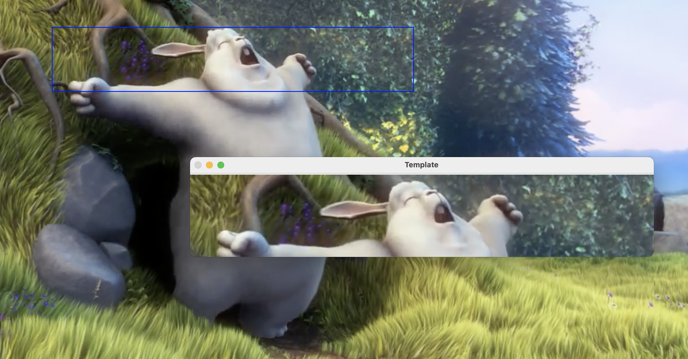
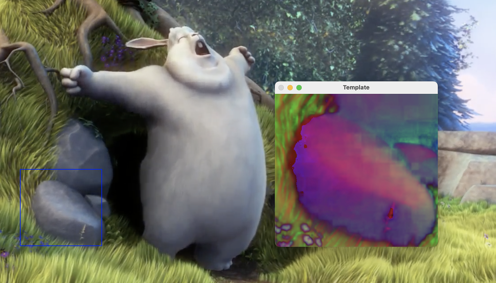
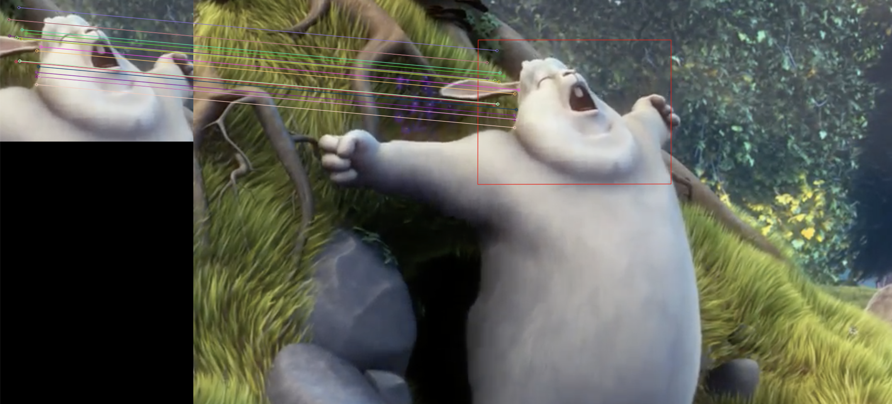
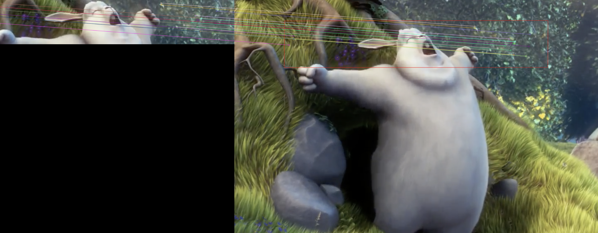
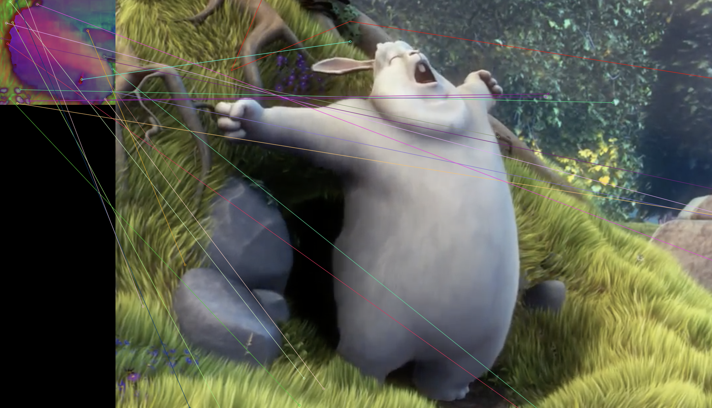

# LW2

## Задание
Задание:
1. Реализовать программу согласно описанию. Можно использовать языки
C++ или Python и любые библиотеки, при этом необходимо чтобы вся
задача не решалась только с помощью одной встроенной функции
(например, lib.detect_template(image, template).
2. Сравнить качество работы двух вариантов реализации по точности
детектирования.
3. Сделать отчёт в виде readme на GitHub, там же должен быть выложен
исходный код.

## Вариант 

Необходимо реализовать два примитивных детектора объектов на
изображении, работающих с помощью поиска эталона на входном
изображении.
1. Прямой поиск одного изображения на другом (template matching)
2. Поиск ключевых точек эталона на входном изображении (например, с
помощью SIFT, ORB..)
Программа должна принимать на вход два изображения, эталон и то, на
котором будет производиться поиск. На выходе программа должна строить
рамку в виде четырехугольника в области, где с наибольшей вероятностью
находится искомый объект. Необходимо протестировать оба варианта
программы на разных изображениях (например, сначала в качестве эталона
использовать вырезанный фрагмент входного изображения, а затем
изображение какого-либо предмета сцены, присутствующего на входном
изображении, но сфотографированного с другого ракурса или с другим
освещением), не менее 10 тестовых примеров.
## Теория
Сопоставление с шаблоном - это метод обработки цифрового изображения для поиска небольших 
частей изображения, которые соответствуют изображение шаблона. Его можно использовать на производстве как часть контроля качества, как способ навигации мобильного робота или как способ обнаружения краев на изображениях.

Сначала в SIFT извлекаются ключевые точки объектов из набора контрольных изображений и запоминаются в базе данных. 
Объект распознаётся в новом изображении путём сравнивания каждого признака из нового изображения с признаками из базы данных и нахождения признаков-кандидатов на основе евклидова расстояния между векторами признаков. 
Из полного набора соответствий в новом изображении отбираются поднаборы ключевых точек, которые наиболее хорошо согласуются с объектом по его местоположению, масштабу и ориентации. 

## Пример работы.
### Template matching:

### SIFT:

### Вывод:

Template matching быстрее и точнее находит фрагменты, котрые присутствуют на эталоне. 
Однако он не может найти измененные изображения.

SIFT так же хорошо справляется с одинаковыми фрагментами, при этом он способен находить отдельные элементы.

## Источники
- https://docs.opencv.org/4.x/d4/dc6/tutorial_py_template_matching.html
- https://docs.opencv.org/4.x/da/df5/tutorial_py_sift_intro.html